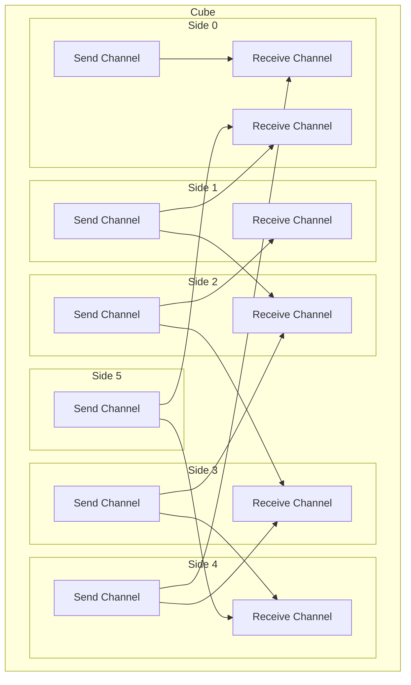

```mermaid
flowchart
direction LR
subgraph Cube
    subgraph "Side 0"
    Send0[Send Channel]-->Receive5
    Receive0[Receive Channel]
    end
    subgraph "Side 1"
    Send1[Send Channel]-->Receive0
    Receive1[Receive Channel]
    end
    subgraph "Side 2"
    Send2[Send Channel]-->Receive1
    Receive2[Receive Channel]
    end
    subgraph "Side 3"
    Send3[Send Channel]-->Receive2
    Receive3[Receive Channel]
    end
    subgraph "Side 4"
    Send4[Send Channel]-->Receive3
    Receive4[Receive Channel]
    end
    subgraph "Side 5"
    Send5[Send Channel]-->Receive4
    Receive5[Receive Channel]
    end
    Send1-->Receive2
    Send2-->Receive3
    Send3-->Receive4
    Send4-->Receive5
    Send5-->Receive0
    end
```
