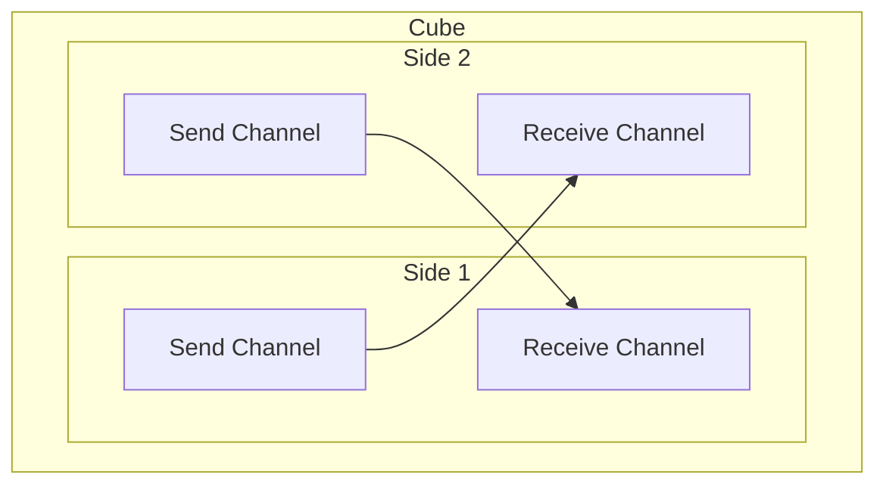

```mermaid
flowchart
subgraph Cube
    subgraph "Side 1"
    Send1[Send Channel]
    Receive1[Receive Channel]
    end
    subgraph "Side 2"
    Receive2[Receive Channel]
    Send2[Send Channel]-->Receive1
    end
    Send1-->Receive2
end
```
