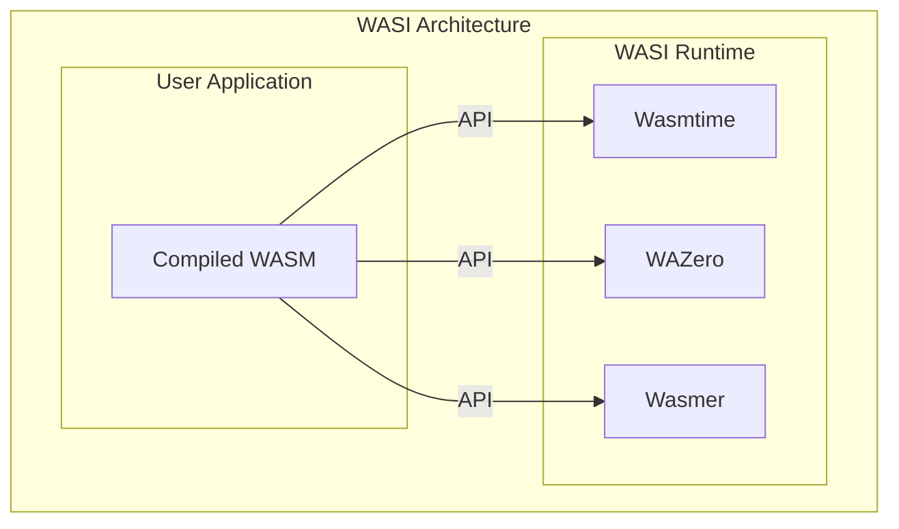

```mermaid
flowchart
subgraph "WASI Architecture"
    subgraph "User Application"
    WASMC[Compiled WASM]
    end
    subgraph "WASI Runtime"
    WASMC--API-->Wasmtime
    WASMC--API-->WAZero
    WASMC--API-->Wasmer
    end
end
```
